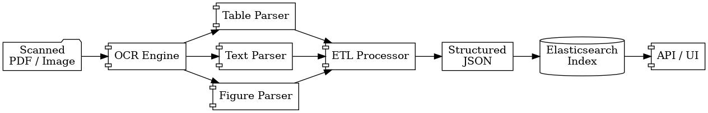
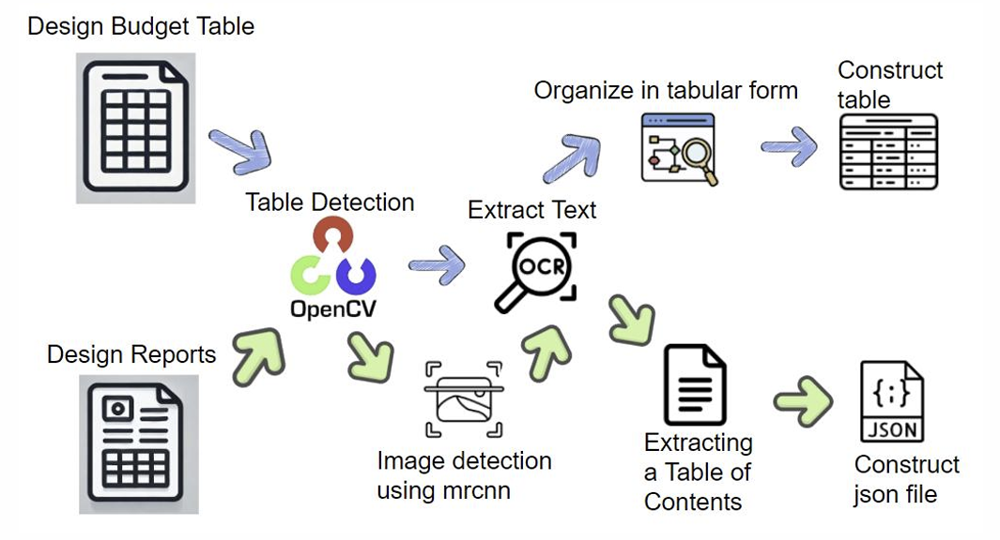

# ConsBASE: Construction Document Analysis Framework

ConsBASE is an end-to-end document analysis system designed to convert scanned construction documents into structured JSON outputs.  
The framework integrates OCR, table detection, image detection, and text structuring into a unified ETL pipeline.

---

## 📌 Overview

ConsBASE processes construction documents (e.g., design reports, budget tables) and extracts structured information such as:

- Tables
- Figures (images)
- Text paragraphs
- Table of contents (index)

---

## 🏗️ System Architecture



The system follows a modular pipeline:

1. **Table Detection (OpenCV)**
2. **OCR (PaddleOCR)**
3. **Image Detection (Mask R-CNN)**
4. **Text Structuring**
5. **JSON Construction**

---

## 🔄 Processing Pipeline



The workflow is:

1. Input document (PDF/Image)
2. Detect tables using OpenCV
3. Extract text using OCR
4. Detect images using Mask R-CNN
5. Organize extracted content
6. Generate structured JSON output

---

## 📁 Project Structure

```bash
cals/
├── environment/                 # Docker environment
│   └── Dockerfile
│
├── code/
│   ├── main.py                 # Entry point
│   ├── document.py             # Full document pipeline
│   ├── table.py                # Table extraction module
│   ├── Utils.py                # Mask R-CNN utilities
│   ├── mrcnn/                  # Mask R-CNN implementation
│   └── run                     # Execution script
│
├── data/                       # Input images
│
└── README.md
```
---

## 🚀 Installation & Execution Guide

### 1️⃣ Clone Repository

```bash
git clone https://github.com/SeoDSeok/cals.git
cd cals
```
### 2️⃣ Build Docker Environment

```bash
cd environment
docker build -t consbase .
```
### 3️⃣ Download Mask R-CNN Weights

We use pre-trained weights hosted on Google Drive:

```bash
wget --load-cookies ~/cookies.txt "https://docs.google.com/uc?export=download&confirm=$(wget --quiet --save-cookies ~/cookies.txt --keep-session-cookies --no-check-certificate 'https://drive.google.com/file/d/1g8KdJ9PDYQJOzxc2HAJa-SoxwI4RHukB/view?usp=sharing' -O- | sed -rn 's/.*confirm=([0-9A-Za-z_]+).*/\1\n/p')&id=1g8KdJ9PDYQJOzxc2HAJa-SoxwI4RHukB" -O mask_custom.h5 && rm -rf ~/cookies.txt
```

Move the file:

```bash
mv mask_custom.h5 ../code/
```

### 4️⃣ Run the System

```bash
cd ../code
```
Run Docker:

```bash
docker run -it --rm \
-v $(pwd):/workspace \
-v $(pwd):/data \
-w /workspace \
consbase \
bash ./run
```
⚙️ Execution Mode

Inside run file:
```bash
# Table extraction mode
# python -u main.py table.png 0 <API_KEY> <OCR_URL>

# Document extraction mode
python -u main.py document.png 1 <API_KEY> <OCR_URL>
```

📄 Output

Results are saved in:
```bash
/results/
```

Example JSON:

```json
[
  {
    "page": 1,
    "id": 1,
    "type": "table",
    "bbox": [50, 100, 400, 600]
  }
]
```

⚠️ Notes
GPU Usage

GPU is optional

Mask R-CNN runs on CPU if GPU unavailable

Common Issues

❌ Docker cannot access GPU

could not select device driver "" with capabilities: [[gpu]]

→ GPU runtime not configured (safe to ignore)